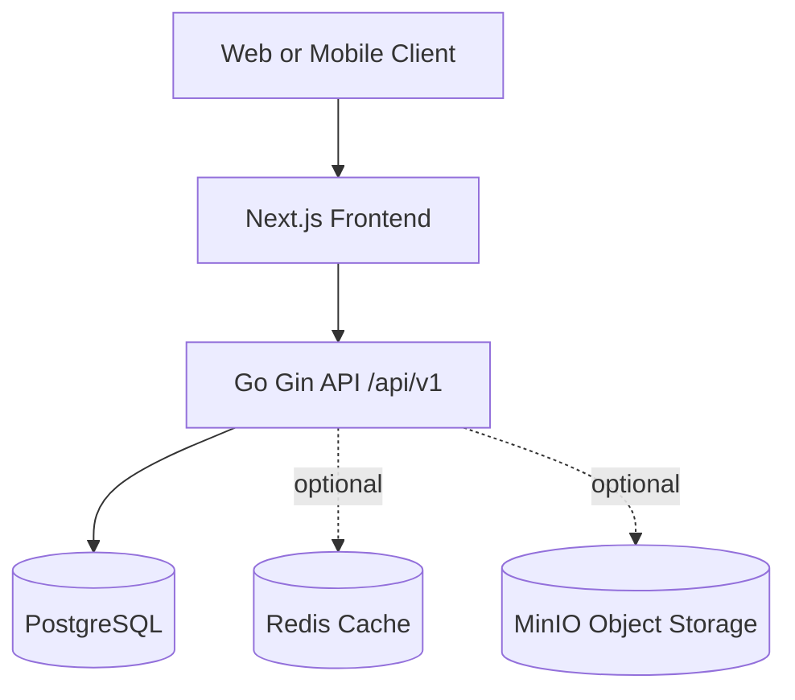

# Mouthouq API Architecture

```mermaid
flowchart TD
    Client[Web or Mobile Client] --> Frontend[Next.js Frontend]
    Frontend --> API[Go Gin API /api/v1]
    API --> Postgres[(PostgreSQL)]

    API -. optional .-> Redis[(Redis Cache)]
    API -. optional .-> MinIO[(MinIO Object Storage)]
```

Note: Redis and MinIO are configured in docker-compose but not yet wired in the application.
