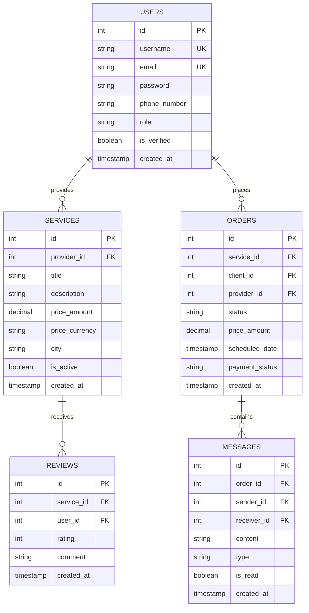

# Database Architecture

## Collections Schema (PostgreSQL)

### Users Collection
```sql
-- Users Table
CREATE TABLE users (
    id SERIAL PRIMARY KEY,
    username VARCHAR(50) UNIQUE NOT NULL,
    email VARCHAR(100) UNIQUE NOT NULL,
    password VARCHAR(255) NOT NULL,
    phone_number VARCHAR(20),
    city VARCHAR(100),
    address TEXT,
    latitude DECIMAL(10,8),
    longitude DECIMAL(11,8),
    role VARCHAR(20) CHECK (role IN ('user', 'admin')),
    created_at TIMESTAMP DEFAULT CURRENT_TIMESTAMP,
    updated_at TIMESTAMP DEFAULT CURRENT_TIMESTAMP,
    is_verified BOOLEAN DEFAULT FALSE,
    profile_image VARCHAR(255)
);
```
### Service Collection
```sql
-- Services Table
CREATE TABLE services (
    id SERIAL PRIMARY KEY,
    provider_id INTEGER REFERENCES users(id),
    title VARCHAR(255) NOT NULL,
    description TEXT,
    category VARCHAR(100),
    price_amount DECIMAL(10,2),
    price_currency VARCHAR(3),
    price_unit VARCHAR(20) CHECK (price_unit IN ('hour', 'job', 'day')),
    city VARCHAR(100),
    latitude DECIMAL(10,8),
    longitude DECIMAL(11,8),
    images TEXT[],
    is_active BOOLEAN DEFAULT TRUE,
    rating_average DECIMAL(2,1),
    rating_count INTEGER DEFAULT 0,
    created_at TIMESTAMP DEFAULT CURRENT_TIMESTAMP,
    updated_at TIMESTAMP DEFAULT CURRENT_TIMESTAMP
);
```
```sql
-- Service Availability Table
CREATE TABLE service_availability (
    id SERIAL PRIMARY KEY,
    service_id INTEGER REFERENCES services(id),
    day_of_week VARCHAR(10),
    hours TEXT[],
    UNIQUE(service_id, day_of_week)
);
```
### Reviews Collection
```sql
-- Reviews Table
CREATE TABLE reviews (
    id SERIAL PRIMARY KEY,
    service_id INTEGER REFERENCES services(id),
    user_id INTEGER REFERENCES users(id),
    rating INTEGER CHECK (rating BETWEEN 1 AND 5),
    comment TEXT,
    images TEXT[],
    created_at TIMESTAMP DEFAULT CURRENT_TIMESTAMP,
    updated_at TIMESTAMP DEFAULT CURRENT_TIMESTAMP
);
```
### Orders Collection
```sql
-- Orders Table
CREATE TABLE orders (
    id SERIAL PRIMARY KEY,
    service_id INTEGER REFERENCES services(id),
    client_id INTEGER REFERENCES users(id),
    provider_id INTEGER REFERENCES users(id),
    status VARCHAR(20) CHECK (status IN ('pending', 'accepted', 'completed', 'cancelled')),
    price_amount DECIMAL(10,2),
    price_currency VARCHAR(3),
    scheduled_date TIMESTAMP,
    address TEXT,
    latitude DECIMAL(10,8),
    longitude DECIMAL(11,8),
    payment_status VARCHAR(20) CHECK (payment_status IN ('pending', 'paid', 'refunded')),
    created_at TIMESTAMP DEFAULT CURRENT_TIMESTAMP,
    updated_at TIMESTAMP DEFAULT CURRENT_TIMESTAMP
);
```
### Messages Collection
```sql
-- Messages Table
CREATE TABLE messages (
    id SERIAL PRIMARY KEY,
    order_id INTEGER REFERENCES orders(id),
    sender_id INTEGER REFERENCES users(id),
    receiver_id INTEGER REFERENCES users(id),
    content TEXT,
    type VARCHAR(20) CHECK (type IN ('text', 'image')),
    is_read BOOLEAN DEFAULT FALSE,
    created_at TIMESTAMP DEFAULT CURRENT_TIMESTAMP
);
```
### Notifications Collection
```sql
-- Notifications Table
CREATE TABLE notifications (
    id SERIAL PRIMARY KEY,
    user_id INTEGER REFERENCES users(id),
    type VARCHAR(20) CHECK (type IN ('order', 'message', 'system')),
    title VARCHAR(255),
    message TEXT,
    is_read BOOLEAN DEFAULT FALSE,
    related_id INTEGER,
    created_at TIMESTAMP DEFAULT CURRENT_TIMESTAMP
);
```
### Indexes
```sql
-- Indexes
CREATE INDEX idx_users_city ON users(city);
CREATE INDEX idx_services_category ON services(category);
CREATE INDEX idx_services_city ON services(city);
CREATE INDEX idx_services_provider ON services(provider_id);
CREATE INDEX idx_orders_client ON orders(client_id);
CREATE INDEX idx_orders_provider ON orders(provider_id);
CREATE INDEX idx_orders_status ON orders(status);
CREATE INDEX idx_messages_order ON messages(order_id);
CREATE INDEX idx_messages_sender ON messages(sender_id);
CREATE INDEX idx_messages_receiver ON messages(receiver_id);
CREATE INDEX idx_reviews_service ON reviews(service_id);
CREATE INDEX idx_reviews_user ON reviews(user_id);
```


## ER Diagram



