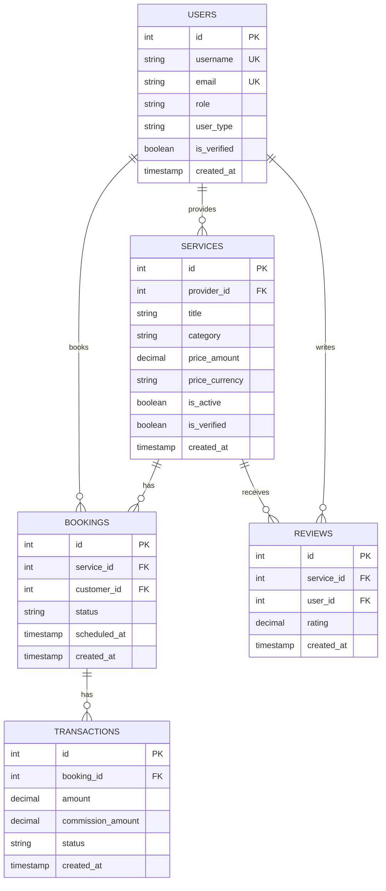

# Database Architecture

## Tables (GORM AutoMigrate)
Schema is generated from Go models in `src/backend/internal/models` at startup.
The SQL below is a reference for the current model fields.

### users
```sql
CREATE TABLE users (
    id BIGSERIAL PRIMARY KEY,
    username TEXT UNIQUE NOT NULL,
    first_name TEXT,
    last_name TEXT,
    email TEXT UNIQUE NOT NULL,
    password TEXT NOT NULL,
    phone_number TEXT,
    city TEXT,
    address TEXT,
    latitude DECIMAL(10,8),
    longitude DECIMAL(11,8),
    role TEXT DEFAULT 'user',
    user_type TEXT DEFAULT 'customer',
    subscription_plan TEXT DEFAULT 'none',
    subscription_expiry TIMESTAMP,
    verification_status TEXT DEFAULT 'unverified',
    created_at TIMESTAMP,
    updated_at TIMESTAMP,
    is_verified BOOLEAN DEFAULT FALSE,
    profile_image TEXT
);
```

### services
```sql
CREATE TABLE services (
    id BIGSERIAL PRIMARY KEY,
    created_at TIMESTAMP,
    updated_at TIMESTAMP,
    deleted_at TIMESTAMP,
    provider_id BIGINT NOT NULL REFERENCES users(id),
    title TEXT NOT NULL,
    description TEXT,
    category TEXT,
    price_amount DECIMAL(10,2),
    price_currency TEXT,
    price_unit TEXT,
    city TEXT,
    latitude DECIMAL(10,8),
    longitude DECIMAL(11,8),
    images TEXT[],
    tags TEXT[],
    is_active BOOLEAN DEFAULT TRUE,
    is_verified BOOLEAN DEFAULT FALSE,
    trust_score DECIMAL(5,2) DEFAULT 0,
    response_time_mins INTEGER DEFAULT 0,
    rating_average DECIMAL(5,2),
    rating_count INTEGER DEFAULT 0
);
```

### reviews
```sql
CREATE TABLE reviews (
    id BIGSERIAL PRIMARY KEY,
    created_at TIMESTAMP,
    updated_at TIMESTAMP,
    deleted_at TIMESTAMP,
    service_id BIGINT NOT NULL REFERENCES services(id),
    user_id BIGINT NOT NULL REFERENCES users(id),
    rating DECIMAL(5,2) NOT NULL,
    comment TEXT,
    is_ai_verified BOOLEAN DEFAULT FALSE,
    ai_confidence_score DECIMAL(5,2),
    ai_analysis_feedback TEXT
);
```

### bookings
```sql
CREATE TABLE bookings (
    id BIGSERIAL PRIMARY KEY,
    created_at TIMESTAMP,
    updated_at TIMESTAMP,
    deleted_at TIMESTAMP,
    service_id BIGINT NOT NULL REFERENCES services(id),
    customer_id BIGINT NOT NULL REFERENCES users(id),
    status TEXT DEFAULT 'pending',
    scheduled_at TIMESTAMP NOT NULL,
    notes TEXT
);
```

### transactions
```sql
CREATE TABLE transactions (
    id BIGSERIAL PRIMARY KEY,
    created_at TIMESTAMP,
    updated_at TIMESTAMP,
    deleted_at TIMESTAMP,
    booking_id BIGINT NOT NULL REFERENCES bookings(id),
    amount DECIMAL(10,2) NOT NULL,
    commission_amount DECIMAL(10,2) NOT NULL,
    currency TEXT DEFAULT 'MAD',
    status TEXT DEFAULT 'pending',
    payment_method TEXT,
    transaction_ref TEXT UNIQUE
);
```

## ER Diagram

